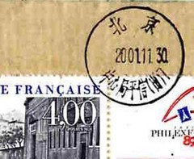

# jiaoge
_Keeping track of postcards if you're into it_

# Why
I personally send a lot of postcards to my family and friends whenever I'm
traveling.

One day it hit me -- it would be really nice to keep track _which_ postcard
did I send to _whom_ from _where_. On top of that, if only I could tell
how long have the postcards spent in transit?

I built this project as minimal, simple way to make this happen.

The whole application can be easily deployed on free _Heroku_ tier.
It relies on PostgreSQL instance being running and attached to the app.

# What
This is a very basic Django-based web application with barely any front-end
code, mostly leveraging the awesome Django Admin system.

_Normalize_ and _Milligram_ CSS framework are used to make the few
server-rendered views to look semi-decent on both desktop and mobile devices.

There's absolutely no JavaScript code involved.

# How
One can use the admin pages to create a simple "address book" (actually more
of a _rolodex_ as I wanted to avoid storing addresses) of friends and family
members.

As a second step it's possible to create records for the postcards to be sent
from one's travels. A card record is very rudimentary and consists of
the postcard source (where was it posted), destination (selected contact
from the address book) and dispatch date.

An extra feature allows user to upload a picture of the postcard to be attached
to the card record.

In a basic form the application user can also edit the card records to append
the information about the time of postcard reception.

# Bonus: interactivity
The cherry on top is the ability for the postcard receivers to confirm
their arrival (claim the card).

There's a card claim view: `/claim/<CODE>` that can be used by the addressee
to let the sender know about the reception with a single press of a button.
Naturally, this relies on your friends/family being bothered enough to actually
open the claiming URL.

You can write/print the URL on your postcards to let the addressees enter
the claim page. I personally use _TinyURL_ to shorten the long Heroku address.

I also researched and opted for standard-format (48.5mm × 16.9mm) stickers
with pre-printed shortened claim URL, to which I add (by hand) the card
claim code (generated by the great _hashids_ library).
Every postcard has an unique claim address and can only be claimed once
(naturally). Finally I let the received give me a comment/feedback before
clicking the button.

